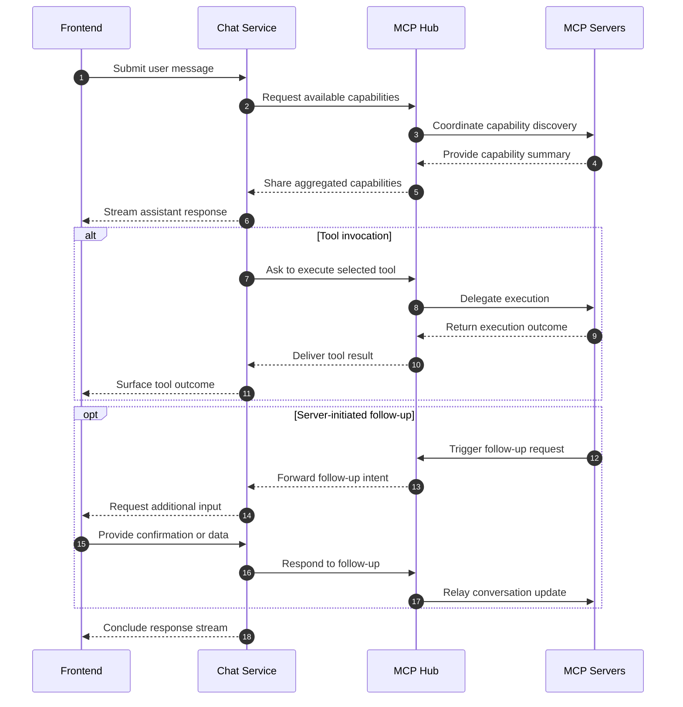

```mermaid

%% High-Level Chat <> MCP Interaction Overview
%% Generated on 2025-09-24
sequenceDiagram
    autonumber
    participant FE as Frontend
    participant Chat as Chat Service
    participant Hub as MCP Hub
    participant Servers as MCP Servers

    FE->>Chat: Submit user message
    Chat->>Hub: Request available capabilities
    Hub->>Servers: Coordinate capability discovery
    Servers-->>Hub: Provide capability summary
    Hub-->>Chat: Share aggregated capabilities
    
    Chat-->>FE: Stream assistant response
    
    alt Tool invocation
        Chat->>Hub: Ask to execute selected tool
        Hub->>Servers: Delegate execution
        Servers-->>Hub: Return execution outcome
        Hub-->>Chat: Deliver tool result
        Chat-->>FE: Surface tool outcome
    end
    
    opt Server-initiated follow-up
        Servers->>Hub: Trigger follow-up request
        Hub-->>Chat: Forward follow-up intent
        Chat-->>FE: Request additional input
        FE->>Chat: Provide confirmation or data
        Chat->>Hub: Respond to follow-up
        Hub->>Servers: Relay conversation update
    end
    
    Chat-->>FE: Conclude response stream
```
