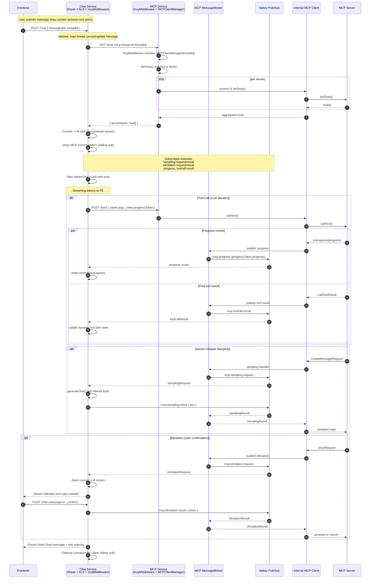
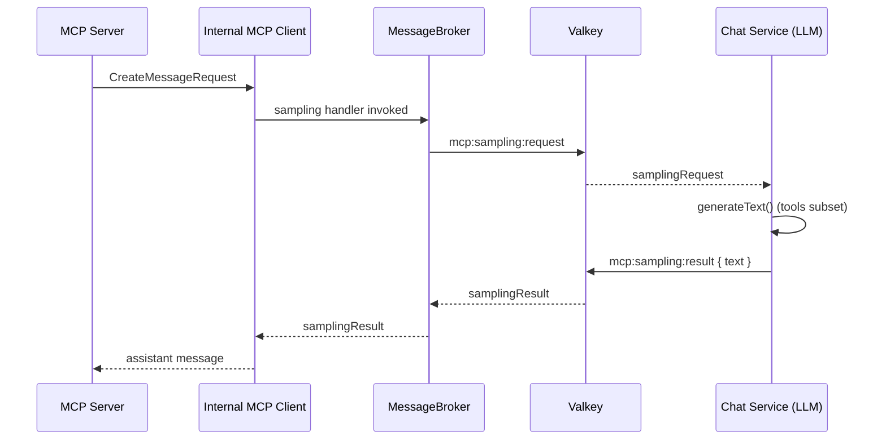
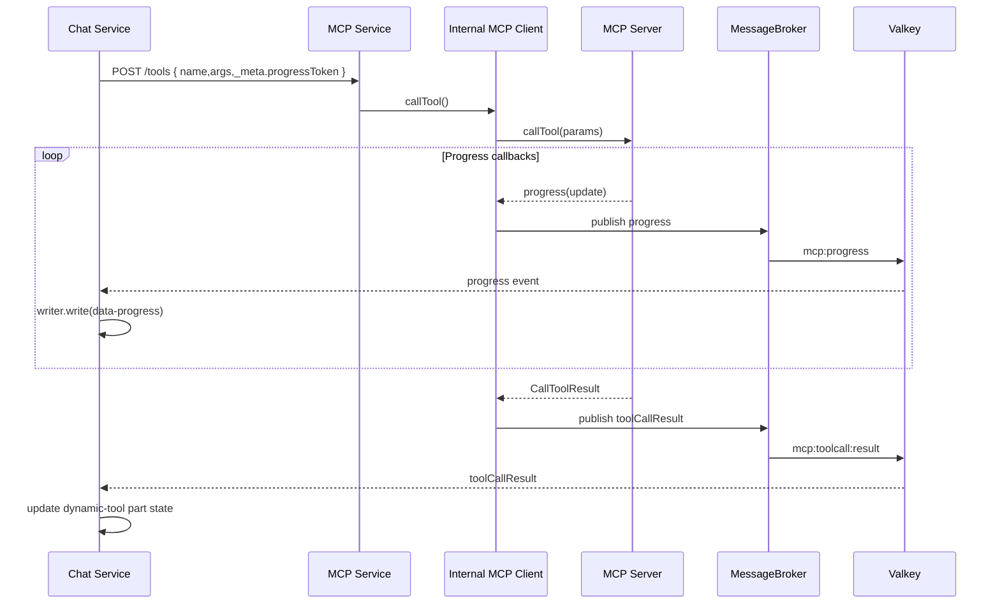
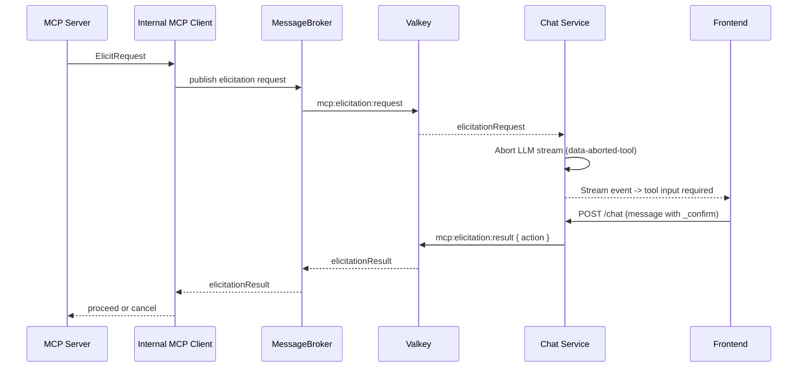

# 一次完整聊天请求

```mermaid
%% Full Chat Request Lifecycle with MCP Integration
%% Generated on 2025-09-24

sequenceDiagram
    autonumber
    participant FE as Frontend
    participant Chat as Chat Service<br>(Route + ALS + mcpMiddleware)
    participant MCP as MCP Service<br>(mcpMiddleware + MCPClientManager)
    participant Broker as MCP MessageBroker
    participant PubSub as Valkey Pub/Sub
    participant MCPC as Internal MCP Client
    participant MCPS as MCP Server

    Note over FE,Chat: User submits message (may contain dynamic-tool parts)
    FE->>Chat: POST /chat { messages[0], threadId }

    Note over Chat: Validate, load thread, persist/update message
    Chat->>MCP: GET /tools (mcp-thread-id=threadId)
    MCP->>MCP: mcpMiddleware resolves MCPClientManager(threadId)
    MCP->>MCP: listTools() (cached or fetch)
    loop per server
        MCP->>MCPC: connect & listTools()
        MCPC->>MCPS: listTools()
        MCPS-->>MCPC: tools[]
    end
    MCPC-->>MCP: aggregated tools
    MCP-->>Chat: { serverName: Tool[] }
    Chat->>Chat: Convert -> AI tool map (prefixed names)
    Chat->>Chat: setup MCP event handlers (Valkey sub)
    Note over Chat,PubSub: Subscribed channels:<br> sampling:request/result<br> elicitation:request/result<br> progress, toolcall:result

    Chat->>Chat: Start streamText (LLM) with tools
    Note over Chat: Streaming tokens to FE

    alt Tool Call (LLM decides)
        Chat->>MCP: POST /tools { name,args,_meta.progressToken }
        MCP->>MCPC: callTool()
        MCPC->>MCPS: callTool()
        par Progress events
            MCPS-->>MCPC: onprogress(progress)
            MCPC->>Broker: publish progress
            Broker->>PubSub: mcp:progress {progressToken,progress}
            PubSub-->>Chat: progress event
            Chat->>Chat: writer.write(data-progress)
        and Final tool result
            MCPS-->>MCPC: CallToolResult
            MCPC->>Broker: publish tool result
            Broker->>PubSub: mcp:toolcall:result
            PubSub-->>Chat: toolCallResult
            Chat->>Chat: update dynamic-tool part state
        end
    end

    opt Server-Initiated Sampling
        MCPS->>MCPC: CreateMessageRequest
        MCPC->>Broker: sampling handler
        Broker->>PubSub: mcp:sampling:request
        PubSub-->>Chat: samplingRequest
        Chat->>Chat: generateText() with filtered tools
        Chat->>PubSub: mcp:sampling:result { text }
        PubSub-->>Broker: samplingResult
        Broker-->>MCPC: samplingResult
        MCPC-->>MCPS: assistant reply
    end

    opt Elicitation (user confirmation)
        MCPS->>MCPC: ElicitRequest
        MCPC->>Broker: publish elicitation
        Broker->>PubSub: mcp:elicitation:request
        PubSub-->>Chat: elicitationRequest
        Chat->>Chat: Abort current LLM stream
        Chat-->>FE: Stream indicates tool input needed
        FE->>Chat: POST /chat (message w/ _confirm)
        Chat->>PubSub: mcp:elicitation:result { action }
        PubSub-->>Broker: elicitationResult
        Broker-->>MCPC: elicitationResult
        MCPC-->>MCPS: proceed or cancel
    end

    Chat-->>FE: Stream finish (final message + tool outputs)
    Chat->>Chat: Cleanup (unsubscribe, close Valkey sub)

```

# Sampling

```mermaid
%% Server-Initiated Sampling Flow
%% Generated on 2025-09-24
sequenceDiagram
    participant MCPS as MCP Server
    participant MCPC as Internal MCP Client
    participant Broker as MessageBroker
    participant PubSub as Valkey
    participant Chat as Chat Service (LLM)

    MCPS->>MCPC: CreateMessageRequest
    MCPC->>Broker: sampling handler invoked
    Broker->>PubSub: mcp:sampling:request
    PubSub-->>Chat: samplingRequest
    Chat->>Chat: generateText() (tools subset)
    Chat->>PubSub: mcp:sampling:result { text }
    PubSub-->>Broker: samplingResult
    Broker-->>MCPC: samplingResult
    MCPC-->>MCPS: assistant message

```

# Tool call

```mermaid
%% Tool Call + Progress + Result Flow
%% Generated on 2025-09-24
sequenceDiagram
    participant Chat as Chat Service
    participant MCP as MCP Service
    participant MCPC as Internal MCP Client
    participant MCPS as MCP Server
    participant Broker as MessageBroker
    participant PubSub as Valkey

    Chat->>MCP: POST /tools { name,args,_meta.progressToken }
    MCP->>MCPC: callTool()
    MCPC->>MCPS: callTool(params)
    loop Progress callbacks
        MCPS-->>MCPC: progress(update)
        MCPC->>Broker: publish progress
        Broker->>PubSub: mcp:progress
        PubSub-->>Chat: progress event
        Chat->>Chat: writer.write(data-progress)
    end
    MCPS-->>MCPC: CallToolResult
    MCPC->>Broker: publish toolCallResult
    Broker->>PubSub: mcp:toolcall:result
    PubSub-->>Chat: toolCallResult
    Chat->>Chat: update dynamic-tool part state

```

# Elicitation

```mermaid
%% Elicitation (User Confirmation) Flow
%% Generated on 2025-09-24
sequenceDiagram
    participant MCPS as MCP Server
    participant MCPC as Internal MCP Client
    participant Broker as MessageBroker
    participant PubSub as Valkey
    participant Chat as Chat Service
    participant FE as Frontend

    MCPS->>MCPC: ElicitRequest
    MCPC->>Broker: publish elicitation request
    Broker->>PubSub: mcp:elicitation:request
    PubSub-->>Chat: elicitationRequest
    Chat->>Chat: Abort LLM stream (data-aborted-tool)
    Chat-->>FE: Stream event -> tool input required
    FE->>Chat: POST /chat (message with _confirm)
    Chat->>PubSub: mcp:elicitation:result { action }
    PubSub-->>Broker: elicitationResult
    Broker-->>MCPC: elicitationResult
    MCPC-->>MCPS: proceed or cancel

```
